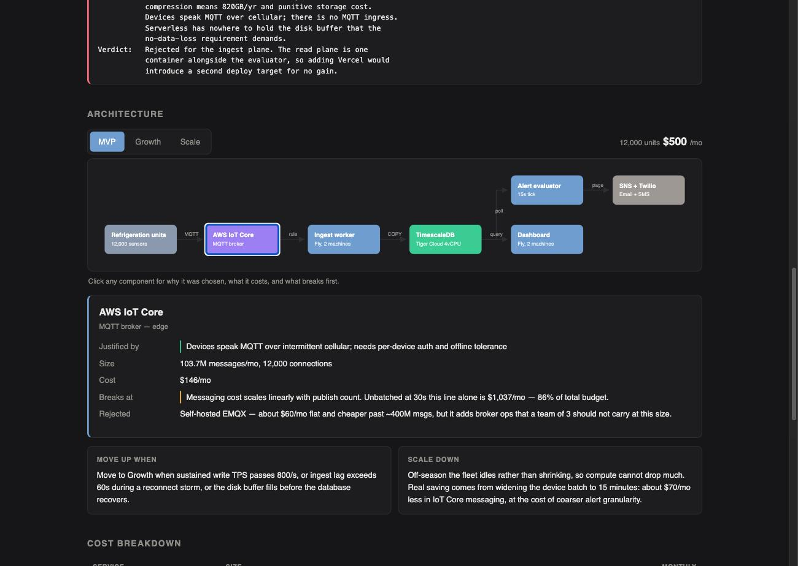
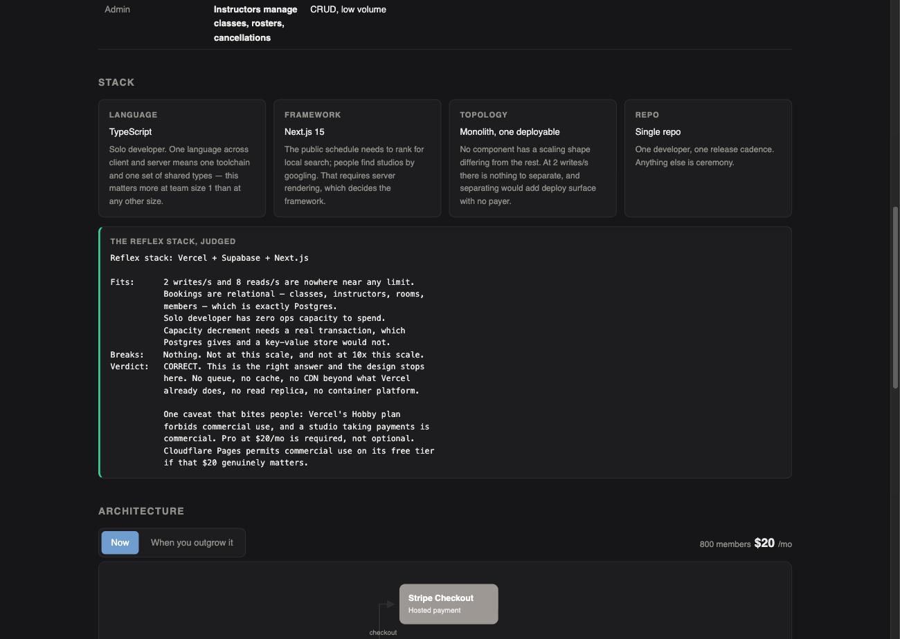
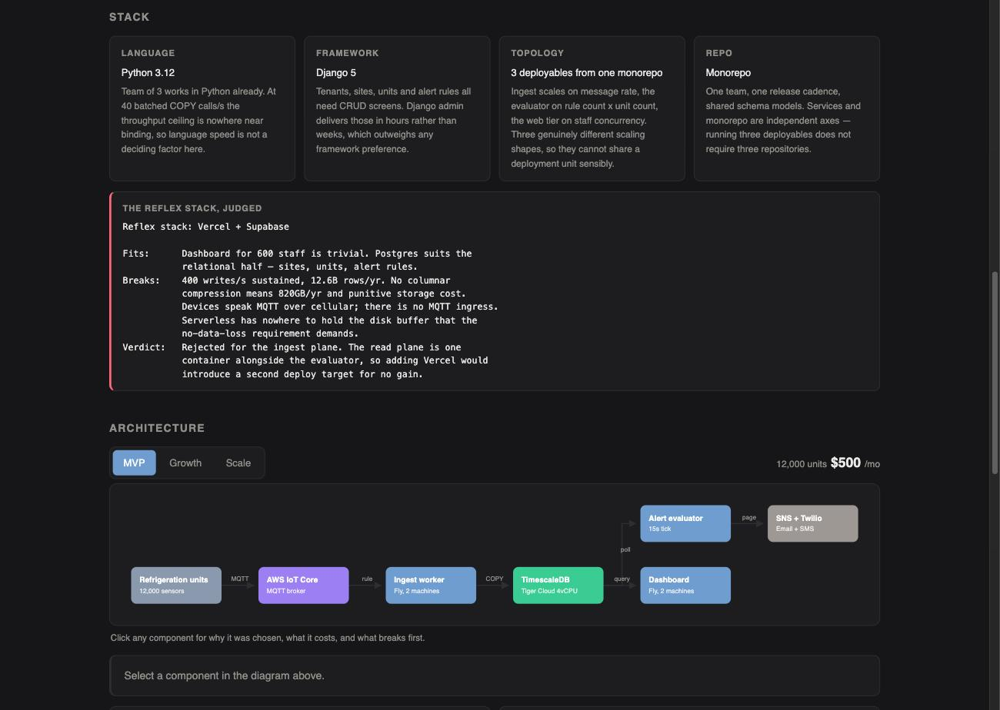

# stackfit

[](https://github.com/ChiFungHillmanChan/stackfit-claude-skill/actions/workflows/validate.yml)
[](LICENSE)
[](https://docs.claude.com/en/docs/claude-code/skills)

**Stop defaulting to the same stack.** Interview-driven system design for Claude Code.

A skill that interviews you about what you are actually building, challenges the stack you were about to reach for, and emits an interactive architecture diagram plus a spec another agent can build from.

Two files come out the other end:

- **`<system>-design.html`** — self-contained interactive page. Scale tiers you can tab between (two for a small system, three for a growing one), clickable components, access patterns, stack decisions, cost breakdown per tier, and an ordered start-here checklist.
- **`<system>-design.md`** — build spec written as constraints, precise enough that a coding agent starts implementing without asking follow-up questions.

## Why

Engineers reach for the same stack regardless of requirements. Vercel plus Supabase gets applied to a 50-user internal tool and to a write-heavy ingestion pipeline alike, because the reflex is faster than the analysis. The cost surfaces later as a migration.

This skill inverts the order: requirements first, components second, and every component has to justify itself against a number.

**It is not anti-default, and it is not pro-complexity.** For plenty of systems the popular stack is genuinely correct, and the skill says so plainly with the reasoning shown. Adding a queue, a cache, a CDN and a read replica to a tool serving 200 people is the same unexamined reflex as forcing serverless onto a write-heavy pipeline — just wearing better clothes. Both are failures, and the skill guards both directions.

The two worked examples in `examples/` are deliberately at opposite ends: one concludes "$20/mo, five components, stop here"; the other rejects the default stack outright.



Every component in the diagram is clickable. Each one has to name the requirement that justified it and the symptom you will see when it runs out — here, that batching device messages is the difference between $146/mo and $1,037/mo.

## Install

Clone straight into your skills directory. `SKILL.md` sits at the repo root, so the clone target becomes the skill name.

```bash
git clone https://github.com/ChiFungHillmanChan/stackfit-claude-skill.git \
  ~/.claude/skills/stackfit
```

For a single project instead of globally:

```bash
git clone https://github.com/ChiFungHillmanChan/stackfit-claude-skill.git \
  .claude/skills/stackfit
```

Restart Claude Code, or start a new session. Verify with `/stackfit`.

## Use

Invoke explicitly:

```
/stackfit
```

Or just describe the problem — the skill triggers on phrasing like "design the architecture for a ride-sharing backend", "what stack should I use for this", "what database should I use", "how should I build this at scale".

You will be asked exactly three questions:

1. What are you building, in one sentence?
2. Who uses it, and roughly how many?
3. What is your budget ceiling per month?

Then it drafts the rest — write TPS, read TPS, p99 target, availability, consistency, data volume, compliance — with the arithmetic shown for every estimate:

```
Write TPS ......  ~40/s   [assumed: 50k DAU x 7 writes/day, 3x peak]
Read TPS .......  ~600/s  [assumed: 15:1 read/write for a feed app]
p99 latency ....  200ms   [assumed: interactive UI, not realtime]
Availability ...  99.9%   [assumed: 43min/mo downtime tolerable]
Budget .........  $300/mo [from Q3]
```

You correct what is wrong. Silence means accepted. This exists because almost nobody can answer "what is your write TPS" cold, but everybody can spot that 50k DAU is off by 10x.

## How It Works

| Phase | What happens |
|---|---|
| 0. Repo scan | Reads `package.json`, migrations, Dockerfiles, workspace config. A repo with 40 Postgres migrations does not get a DynamoDB proposal. |
| 1. Scope | Narrows large systems to one subsystem, then three unskippable questions, then functional requirements. |
| 2. Profile | Classifies the system (S/M/L) and drafts every requirement with visible arithmetic. You correct by exception. |
| 3. Research | 3-6 parallel web searches for current pricing and service limits. Patterns come from built-in knowledge; it does not search for what a load balancer is. |
| 4. Design | Access patterns → data layer → API → application stack → topology and tiers. In that order, because each constrains the next. |
| 5. Gates | Four mandatory checks before anything is drawn. |
| 6. Emit | Writes both files, then validates them. |

### Large systems get narrowed, not attempted

Asked to "design YouTube", the skill refuses to design YouTube. Upload-and-transcode is write-heavy with long-running jobs; watch-and-delivery is read-heavy and CDN-dominated; creator analytics is columnar and tolerates eventual consistency. Averaging those produces a diagram that fits none of them.

It presents the subsystems, you pick one, and the rest become named external dependencies with defined interfaces.

### Access patterns choose the database

The skill never asks "SQL or NoSQL" — that question has no answer. It writes down how the data is actually read and written first, and the store follows:

```
Primary read:   class schedule for a date range, joined to
                instructor and room  -- 8/s, the join IS the query
Primary write:  create booking + decrement capacity
                -- 2/s, must be one transaction
```

That is what picks Postgres, and it is recorded in the output so the choice stays defensible later.

### It decides the application layer too

Language, framework, runtime topology, and repo shape — not just infrastructure. Including the distinction most discussions blur: **monorepo versus polyrepo is code organization; monolith versus services is runtime topology.** They are independent axes. A monorepo running several services is a common and often correct combination.

Services get split only when a boundary clears a stated condition — different scaling shape, different runtime requirement, different availability requirement, hard team boundary, or a genuinely different language. A boundary with no condition does not ship.

### The four gates

**Gate 1 — right-size.** What is the least infrastructure meeting every profile line? Start there. A Class S system is expected to produce a small design, and concluding "$0/mo, one repo, here's what breaks first" is a complete success.

**Gate 2 — every component cites a requirement.** A service enters the design only when attached to a specific profile line. "Good practice" is not a citation. Anything that cannot cite a line gets deleted.

**Gate 3 — the lazy default gets named and judged out loud.** The skill writes down the reflex answer for your system class, then evaluates it against your numbers in the open:

```
Reflex stack: Vercel + Supabase
Fits:      Read TPS 600/s is comfortable. Team of 2 has no ops capacity.
Breaks:    Nothing at this scale.
Verdict:   Correct choice. Revisit at ~5k write TPS.
```

That verdict is a success, not a failure. The reasoning is the deliverable, not the conclusion. Reflexively rejecting popular stacks would just be a different reflex.

**Gate 4 — budget is a hard constraint.** If the first tier exceeds your stated ceiling, the design is wrong and gets revised before emitting. If the requirements genuinely cannot be met within budget, it says so and quantifies the gap rather than quietly shipping something you cannot afford.

## Output Detail

The HTML is fully self-contained — inline SVG, inline CSS, inline JS, zero network requests. It opens from `file://` on a plane.

Each tier carries:

- Its own topology, itemized cost, and total
- A **trigger metric** — the observable signal that says move up. "Go to Growth when DB CPU sustains above 60% or p99 crosses 300ms." Not "when you get bigger."
- A **scale-down path** — what to switch off and what it saves when traffic falls. Scaling down is treated as a requirement, not an afterthought.

Clicking any component shows what it is, which requirement justified it, its exact size and cost, what breaks first with the symptom, and what was rejected in its place.

## Validating Generated Output

```bash
node ~/.claude/skills/stackfit/references/validate.js \
  docs/architecture/my-system-design.html
```

Catches what a visual check misses: cost tables that do not sum to their headline, components that skipped Gate 1, edges pointing at nonexistent nodes, overlapping layout, external requests that break the self-contained rule, and MVP tiers that blow the stated budget.

The skill runs this automatically before reporting done.

## Worked Examples

Two runs at opposite ends of the range, both in `examples/`. Open the HTML locally to click through them.

### Small — and it stays small

`small-booking-app-design.html` — class booking for one yoga studio. 800 members, solo developer, $50/mo ceiling.



The verdict:

```
Reflex stack: Vercel + Supabase + Next.js
Fits:      2 writes/s and 8 reads/s are nowhere near any limit.
           Bookings are relational. Solo dev has zero ops capacity.
           Capacity decrement needs a real transaction.
Breaks:    Nothing. Not at this scale, and not at 10x this scale.
Verdict:   CORRECT. This is the right answer and the design stops
           here. No queue, no cache, no CDN beyond what Vercel
           already does, no read replica, no container platform.
```

Five components, $20/mo, two tiers instead of three. The research phase still earned its place: Vercel's Hobby plan forbids commercial use, and a studio taking payments is commercial — so Pro at $20 is required, not optional. Cloudflare Pages permits commercial use free if that $20 matters.

The output is short because the system is small. That is the correct result, not an omission.

### Large — and the default loses

`refrigeration-telemetry-design.html` — 12,000 sensors, food-safety compliance, $1,200/mo ceiling.

Here the research phase caught the decisive number. AWS IoT Core meters at $1 per million messages, so 12,000 units reporting every 30 seconds generates 1.04 billion messages a month: **$1,037/mo in messaging alone, 86% of the entire budget, before any database exists.** Batching 10 readings per publish cuts that to $104.

A default design never surfaces that number, because a default design never computes it.



This run rejected the reflex stack, with reasons:

```
Reflex stack: Vercel + Supabase
Fits:      Dashboard for 600 staff is trivial. Postgres suits the
           relational half — sites, units, alert rules.
Breaks:    400 writes/s sustained, 12.6B rows/yr. No columnar
           compression means 820GB/yr and punitive storage cost.
           Devices speak MQTT over cellular; there is no MQTT ingress.
           Serverless has nowhere to hold the disk buffer that the
           no-data-loss requirement demands.
Verdict:   Rejected for ingest. The read plane is one container
           alongside the evaluator, so adding Vercel would introduce
           a second deploy target for no gain.
```

It also declined to add Redis at MVP — a 12,000-row current-state table serves dashboard reads fine, so a cache would buy an invalidation bug surface for no measured gain. Redis enters at Growth, when per-reading updates start contending with the ingest path.

Its stack section splits three deployables out of one monorepo, because ingest scales on message rate, the alert evaluator on rule count, and the web tier on staff concurrency — three genuinely different scaling shapes. The yoga studio gets one deployable, because nothing there differs.

## Repo Layout

```
SKILL.md                       the skill itself — procedure
references/
  design-principles.md         the reasoning layer: access patterns, read/write
                               scaling, caching costs, queues, partitioning,
                               consistency, right-sizing, narrowing big systems
  stack-selection.md           language, framework, topology, repo shape
  service-catalog.md           candidate services, ceilings, cost anchors
  html-template.html           interactive diagram scaffold
  spec-template.md             build spec structure
  validate.js                  output validator
examples/
  small-booking-app-design.{html,md}          Class S — stays small
  refrigeration-telemetry-design.{html,md}    Class L — default rejected
```

## Customizing

Most tuning happens in two files. `references/service-catalog.md` holds selection criteria, ceilings, and cost anchors — if your team standardizes on a cloud or has services it will not adopt, encode that there. `references/stack-selection.md` holds language, framework, and repo-shape guidance; if your shop is Python-only or has a standing view on services, put it there.

`references/design-principles.md` is the reasoning layer and is worth reading on its own even if you never run the skill.

To change the diagram's look, edit the CSS variables at the top of `references/html-template.html`. The renderer is data-driven, so nothing below the `END DATA` marker needs touching.

## Caveats

- Cost figures are estimates stamped with a check date. They drift. Verify before committing spend.
- The service catalog's prices age faster than its selection criteria. Phase 3 pulls live pricing, but the catalog itself needs occasional maintenance.
- This produces a design, not code. It stops at the spec deliberately.

## License

MIT
